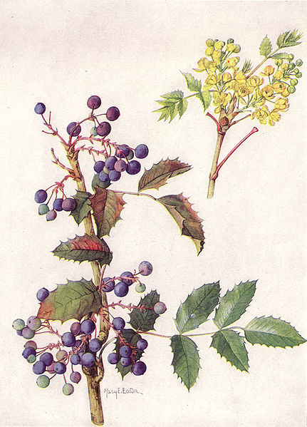

# Mahonia

<table width="100%">
  <tr>
    <td></td>
    <td>
       <i>Mahonia aquifolium</i>: Electronic Theses & Dissertations
    </td>
  </tr>
</table>

## Developer Setup

1. Change to your working directory for new development projects
   `cd .`
1. Clone this repo
   `git clone https://github.com/curationexperts/mahonia.git`
1. Change to the application directory
   `cd mahonia`
1. Start redis
   `redis-server &`
   *note:* use ` &` to start in the background, or run redis in a new terminal 
   session

You can now run the test suite with `bundle exec rake ci`, or start a 
development server with `bundle exec rake hydra:server`.
